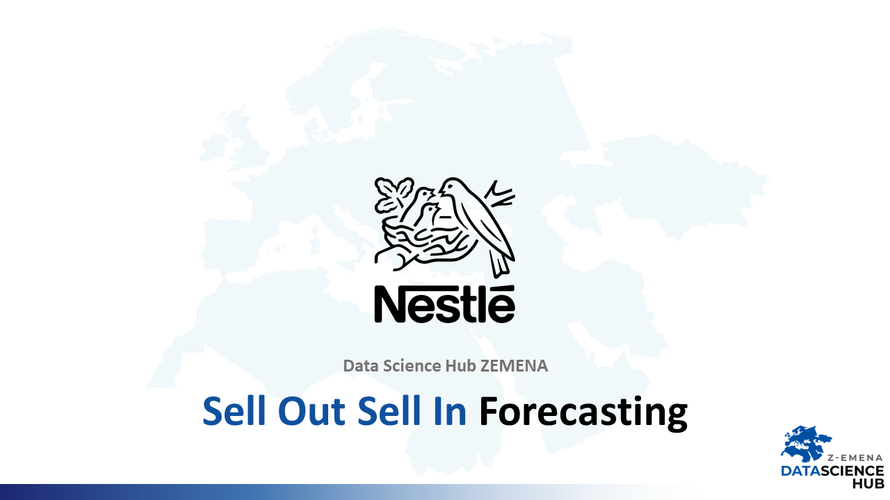
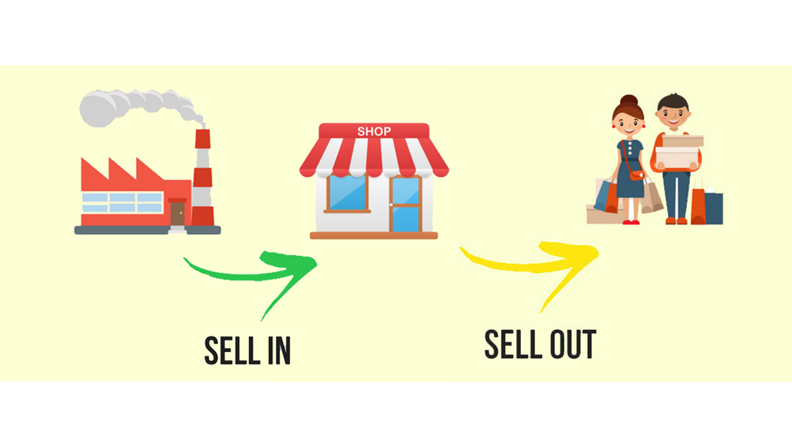

# Sell_Out_Sell_In_Forecasting - Data Science Hub Nestlé

## Why?
Correct forecasting is important from a business perspective. If our forecast assumed less sold products than the actual demand, we lose profit. On the other hand, if our forecast was overestimated, i.e. we actually sell less products, we also lose, this time incurring the cost of product storage.

Sales can be divided into Sell In and Sell Out.

In this Notebook, you will find how to use machine learning for time series using feature engineering.